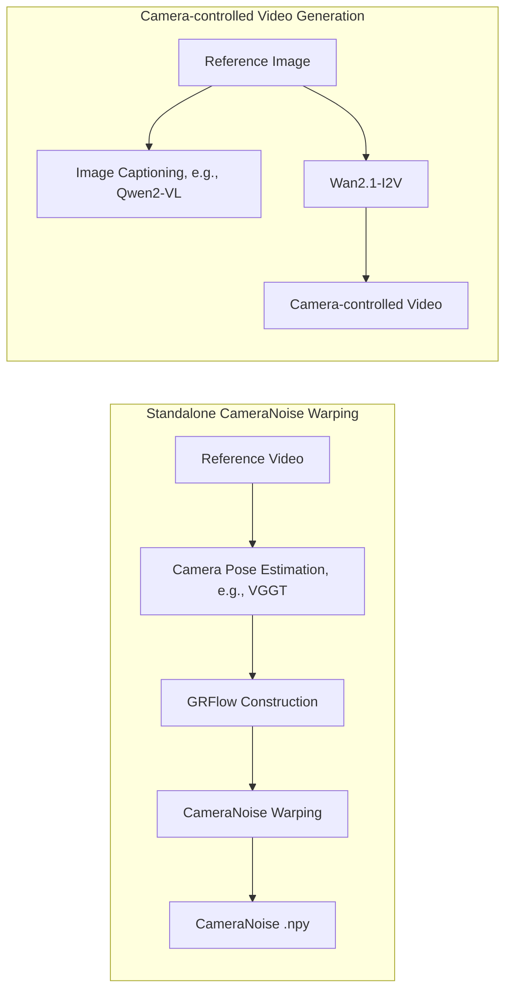
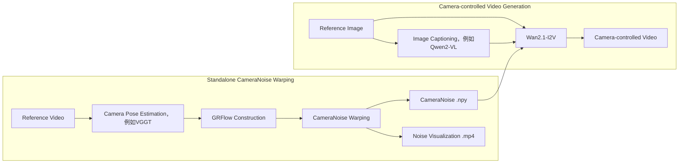

<p align="center">
  
</p>

<h2 align="center">[ICML 2026] CameraNoise: Enabling Faithful Camera Control in Video Diffusion through Geometry-Flow-Guided Noise Warping</h2>

<p align="center">
  <b>Haoyu Zhao, Jiaxi Gu, Haoran Chen, Qingping Zheng, Yeying Jin, Hongyi Yang, Junqi Cheng, Yuang Zhang, Zenghui Lu, Huan Yu, Jie Jiang, Peng Shu, Zuxuan Wu, Yu-Gang Jiang</b>
</p>

<p align="center">
  <a href="https://arxiv.org/abs/2605.30774">
    
  </a>
  <a href="https://gulucaptain.github.io/CameraNoise/">
    
  </a>
  <a href="https://huggingface.co/gulucaptain/CameraNoise-I2V">
    
  </a>
  
  
</p>

[中文](README_zh.md) | English

---

## 📌 News

* **2026-06-01**: We release the Image-to-Video inference pipeline and CameraNoise weights.
* **2026-05-29**: The CameraNoise paper is available on arXiv.
* **2026-05-01**: CameraNoise is accepted to **ICML 2026**.

---

## 🔥 Introduction

**CameraNoise** is a **camera-motion control framework for video diffusion models**, designed to improve both camera trajectory controllability and geometric consistency in video generation. Instead of directly injecting numerical camera parameters into the diffusion backbone, CameraNoise converts camera poses into a temporally coherent stochastic representation in the diffusion noise space. This design decouples camera motion from scene appearance and enables stable transfer of camera trajectories from a reference video to a new reference image.

<p align="center">
  
</p>

This repository includes two main components:

1. **CameraNoise warping**: the standalone condition-construction stage that converts camera motion into `GRFlow` and then into `CameraNoise`. It does not require QwenVL, Wan2.1, or LoRA weights, and is useful for analyzing camera trajectories, debugging noise warping, reusing CameraNoise conditions, or integrating the condition into other video diffusion frameworks.
2. **CameraNoise I2V inference**: the end-to-end image-to-video pipeline. Given a reference image and a reference video, it automatically performs camera estimation, CameraNoise construction, image captioning, and final video generation.

At its core, CameraNoise warping first builds an appearance-agnostic geometric motion field, namely **Geometry-guided Reprojection Flow (GRFlow)**, from camera intrinsics and extrinsics. This flow is then applied to Gaussian noise to synthesize CameraNoise that follows the target camera trajectory while preserving the diffusion noise prior as much as possible. With this noise-space conditioning strategy, CameraNoise serves as a lightweight and reusable camera-motion condition for Wan2.1-I2V, Wan2.1-T2V, and potentially other video diffusion models, enabling videos with stable structure, high visual quality, and faithful camera motion.

---

## ✨ Highlights

* **Reference-video camera control**: estimate camera motion from an arbitrary reference video and transfer it to a new reference image.

* **Standalone CameraNoise warping**: run the pipeline from camera pose estimation to GRFlow construction and CameraNoise synthesis without launching the full video generation process.

* **Geometry-guided Reprojection Flow**: construct an appearance-agnostic geometric motion representation from camera intrinsics and extrinsics, avoiding direct dependence on image textures or semantic content.

* **Noise-space conditioning**: encode camera motion into CameraNoise as a temporally coherent noise condition for video diffusion models.

* **End-to-end I2V pipeline**: run camera estimation, CameraNoise synthesis, image captioning, and final video generation with a single command.

* **Manifest logging**: automatically record inputs, conditions, outputs, and key parameters for reproducible experiments.

---

## 🧩 Pipeline

The overall CameraNoise workflow consists of two relatively independent stages. The first stage is **CameraNoise warping**, which converts camera motion from the reference video into a noise-space condition. The second stage is **video generation**, which takes the reference image, caption, and CameraNoise as inputs and generates the final camera-controlled video.



If you only need the camera-motion condition, you can run **CameraNoise Warping** alone. If you want to generate the final video, run the full I2V pipeline.

---

## 🌀 Using CameraNoise Warping Standalone

In addition to end-to-end I2V inference, this repository supports **standalone CameraNoise condition generation**. This corresponds to the core step of our method: converting the estimated camera motion from a reference video into a noise-space condition that can be used by a diffusion model.

Standalone CameraNoise warping is useful when you want to:

* extract and save CameraNoise from a reference video without immediately generating a video;
* inspect whether camera pose estimation, GRFlow, or noise warping is temporally stable;
* plug CameraNoise into your own video diffusion model or inference framework;
* preprocess reference videos in batches and cache `.npy` conditions for later experiments;
* visualize the noise warping process induced by camera motion.

The basic inputs and outputs are:

```text
Input:
  reference video
  camera pose estimation model, e.g., VGGT
  CameraNoise warping config

Intermediate:
  camera poses
  GRFlow

Output:
  CameraNoise .npy                 # [T,H,W,C]
  CameraNoise visualization .mp4   # for checking temporal noise propagation
```

For detailed usage, configuration options, and visualization examples, please refer to:

[CameraNoise Warping Guide](cameranoise_warping/README.md)

If you only want to reproduce or debug CameraNoise warping, we recommend starting from the standalone documentation above.

---

## 📁 Repository Structure

```text
CameraNoise/
  cameranoise_i2v.py              # entry point for end-to-end I2V inference
  inference.sh                    # example command
  requirements.txt

  scripts/
    build_cameranoise.py          # CameraNoise construction interface; can be used standalone
    caption_image_qwenvl.py       # QwenVL caption generation interface
    generate_camera_control_video.py

  cameranoise_warping/            # standalone CameraNoise warping module
    configs/
      default.yaml                # default CameraNoise warping config
    README.md                     # standalone guide for CameraNoise warping
    README_zh.md                  # Chinese version of the standalone guide

  diffsynth/                      # Wan/DiffSynth inference code

  assets/
    cameranoise_icon.png
    teaser.png

  outputs/
    demo1/
      inputs/                     # reference image / reference video
      conditions/
        noises/                   # CameraNoise .npy and visualization results
        grflows/                  # intermediate GRFlow results
        camerapose/               # camera pose estimation results
      samples/                    # final generated videos
      manifest.json
```

The `cameranoise_warping/` directory is the core condition-construction module of this project. If you only want to generate CameraNoise conditions, please refer to:

```text
cameranoise_warping/README.md
```

---

## ⚙️ Installation

We recommend using [uv](https://docs.astral.sh/uv/) to manage the Python environment. `uv` provides fast dependency installation and convenient management of Python versions, virtual environments, and packages.

### 1. Install uv

macOS / Linux:

```bash
curl -LsSf https://astral.sh/uv/install.sh | sh
```

If `curl` is not available, use:

```bash
wget -qO- https://astral.sh/uv/install.sh | sh
```

Windows PowerShell:

```powershell
powershell -ExecutionPolicy ByPass -c "irm https://astral.sh/uv/install.ps1 | iex"
```

After installation, restart your terminal and check:

```bash
uv --version
```

---

### 2. Create a Python environment

We recommend Python 3.10:

```bash
cd CameraNoise
uv venv --python 3.10.14
```

Activate the environment:

```bash
source .venv/bin/activate
```

For Windows:

```powershell
.venv\Scripts\activate
```

---

### 3. Install PyTorch

Please choose the PyTorch installation command according to your CUDA version. Below is an example for CUDA 12.4:

```bash
uv pip install torch torchvision torchaudio --index-url https://download.pytorch.org/whl/cu124
```

For CUDA 12.1, use:

```bash
uv pip install torch torchvision torchaudio --index-url https://download.pytorch.org/whl/cu121
```

---

### 4. Install project dependencies

```bash
uv pip install -r requirements.txt
```

---

## 📦 Download Pretrained Weights

CameraNoise inference requires the following checkpoints:

| Model | Usage | Hugging Face |
| --- | --- | --- |
| VGGT | estimate camera motion from the reference video | [facebook/VGGT-1B](https://huggingface.co/facebook/VGGT-1B) |
| Qwen2-VL | generate captions for the reference image | [Qwen/Qwen2-VL-7B-Instruct](https://huggingface.co/Qwen/Qwen2-VL-7B-Instruct) |
| Wan2.1-I2V | base image-to-video generation model | [Wan-AI/Wan2.1-I2V-14B-720P](https://huggingface.co/Wan-AI/Wan2.1-I2V-14B-720P) |
| CameraNoise LoRA | our CameraNoise camera-control weights | [gulucaptain/CameraNoise-I2V](https://huggingface.co/gulucaptain/CameraNoise-I2V) |

---

### 1. Install the Hugging Face CLI

```bash
uv pip install -U "huggingface_hub[cli]"
```

If the model requires authentication or you want to use your own Hugging Face token, run:

```bash
huggingface-cli login
```

---

### 2. Download the base model checkpoints

We recommend placing all checkpoints under `checkpoints/`:

```bash
mkdir -p checkpoints
```

Download VGGT:

```bash
huggingface-cli download facebook/VGGT-1B \
  --local-dir checkpoints/VGGT-1B
```

Download Qwen2-VL:

```bash
huggingface-cli download Qwen/Qwen2-VL-7B-Instruct \
  --local-dir checkpoints/Qwen2-VL-7B-Instruct
```

Download Wan2.1-I2V:

```bash
huggingface-cli download Wan-AI/Wan2.1-I2V-14B-720P \
  --local-dir checkpoints/Wan2.1-I2V-14B-720P
```

---

### 3. Download CameraNoise weights

```bash
huggingface-cli download gulucaptain/CameraNoise-I2V \
  --local-dir checkpoints/CameraNoise-I2V
```

After downloading, you can check the LoRA file name with:

```bash
find checkpoints/CameraNoise-I2V -name "*.safetensors"
```

During inference, set `--lora-path` to the corresponding `.safetensors` file, for example:

```bash
--lora-path checkpoints/CameraNoise-I2V/cameranoise_lora.safetensors
```

---

## 🚀 Prepare a Demo

Each demo corresponds to a folder under `outputs/`. Place the reference image and reference video under `inputs/`:

```text
outputs/demo1/
  inputs/
    example.jpg       # reference image
    example.mp4       # reference video that provides camera motion
```

The script will automatically generate the following files:

```text
outputs/demo1/
  conditions/
    caption.txt
    noises/
      example_noises.npy
      example_visualization.mp4
    camerapose/
    grflows/
  samples/
    demo1.mp4
  manifest.json
```

If you already have a CameraNoise `.npy` file, you can also place it under:

```text
outputs/demo1/conditions/noises/
```

We also provide the inference results for the demos under `outputs/` on Hugging Face:

```text
Hugging Face: gulucaptain/CameraNoise-I2V/i2v_demo_results
```

---

## 🎬 End-to-End Inference

Below is an example command for generating a 576x1024 video:

```bash
python cameranoise_i2v.py \
  --demo-dir outputs/demo1 \
  --vggt-ckpt checkpoints/VGGT-1B \
  --cameranoise-config cameranoise_warping/configs/default.yaml \
  --qwenvl-model-path checkpoints/Qwen2-VL-7B-Instruct \
  --model-root checkpoints/Wan2.1-I2V-14B-720P \
  --lora-path checkpoints/CameraNoise-I2V/1024x576/cameranoise_i2v_wan2.1_1024x576_lora.safetensors \
  --height 576 \
  --width 1024 \
  --frames 49 \
  --sample-mode front \
  --degradation-value 0.2 \
  --cfg 3.5 \
  --device cuda \
  --output-type single
```

Batch inference for demos in ``outputs``

```bash
for i in {1..10}; do
    DEMO_DIR="outputs/demo${i}"

    if [ ! -d "$DEMO_DIR" ]; then
        echo "Skip ${DEMO_DIR}: directory not found."
        continue
    fi

    echo "========================================"
    echo "Running ${DEMO_DIR}"
    echo "========================================"

    python cameranoise_i2v.py \
        --demo-dir "$DEMO_DIR" \
        --vggt-ckpt checkpoints/VGGT-1B \
        --cameranoise-config cameranoise_warping/configs/default.yaml \
        --qwenvl-model-path checkpoints/Qwen2-VL-7B-Instruct \
        --model-root checkpoints/Wan2.1-I2V-14B-720P \
        --lora-path checkpoints/CameraNoise-I2V/1024x576/cameranoise_i2v_wan2.1_1024x576_lora.safetensors \
        --height 576 \
        --width 1024 \
        --frames 49 \
        --sample-mode front \
        --degradation-value 0.2 \
        --cfg 3.5 \
        --device cuda \
        --output-type single
done
```

---

## 🔁 Recommended Workflow

The end-to-end CameraNoise pipeline automatically runs the following steps:



For debugging, we recommend splitting the full pipeline into three stages:

1. **Caption stage**: generate `caption.txt` for the reference image.
2. **CameraNoise warping stage**: generate CameraNoise `.npy` and visualization videos from the reference video.
3. **Video generation stage**: reuse the existing caption and CameraNoise to run Wan2.1-I2V generation.

This staged workflow avoids repeatedly loading VGGT, QwenVL, and Wan2.1-I2V, and also makes it easier to cache CameraNoise conditions for batch experiments. In particular, when testing different prompts, LoRA weights, or generation settings, fixing the same CameraNoise condition helps isolate how the video diffusion model responds to the camera motion.

---

## 📐 CameraNoise Resolution

`cameranoise_i2v.py` automatically infers the spatial size of CameraNoise from the target video resolution:

```python
cameranoise_downscale_size = [height // 8, width // 8]
```

For example:

```text
576x1024 -> [72, 128]
768x768  -> [96, 96]
```

The default reference size for amplitude/std scaling is:

```bash
--cameranoise-std-reference-size 96
```

To manually specify the saved CameraNoise size, use:

```bash
--cameranoise-downscale-size 72,128
```

---

## 🧪 Important Arguments

| Argument | Description |
| --- | --- |
| `--demo-dir` | Demo directory. It should contain an `inputs/` folder. |
| `--vggt-ckpt` | Path to VGGT weights. Required when generating CameraNoise from a reference video. |
| `--cameranoise-config` | Optional YAML config. It is merged with `cameranoise_warping/configs/default.yaml`. |
| `--cameranoise-std-reference-size` | Reference size for CameraNoise amplitude/std scaling. Default: `96`. |
| `--cameranoise-downscale-size` | Saved CameraNoise size in `H,W` format. Default: `[height/8, width/8]`. |
| `--cameranoise-overwrite` | Regenerate CameraNoise even if an existing file is found. |
| `--qwenvl-model-path` | Path to QwenVL weights. Required when `caption.txt` does not exist. |
| `--overwrite-caption` | Regenerate caption even if `caption.txt` already exists. |
| `--model-root` | Directory of the Wan2.1-I2V-14B-720P model. |
| `--lora-path` | Path to the CameraNoise LoRA weights. |
| `--height`, `--width` | Resolution of the generated video. |
| `--frames` | Number of frames to generate. |
| `--cfg` | Classifier-free guidance scale. |
| `--degradation-value` | CameraNoise degradation value. If not provided, it is randomly sampled from `[0, 0.6]`. |
| `--sample-mode` | Frame sampling mode for CameraNoise: `front` or `even`. |
| `--output-type` | Output mode: `single`, `concat`, or `ct1`. |
| `--device` | Inference device, e.g., `cuda`. |

---

## 📤 Outputs

After a successful run, you will get:

```text
conditions/caption.txt                 # QwenVL image caption
conditions/noises/*_noises.npy         # CameraNoise, [T,H,W,C]
conditions/noises/*_visualization.mp4  # CameraNoise visualization
samples/*.mp4                          # final generated video
manifest.json                          # record of inputs, conditions, outputs, and parameters
```

The `manifest.json` file records the input files, generated condition files, final video paths, and key runtime parameters, which helps ensure reproducible experiments.

---

## ♻️ Reusing Existing Conditions

If `conditions/caption.txt` already exists, the script will reuse it automatically. To regenerate the caption, pass:

```bash
--overwrite-caption
```

If a CameraNoise `.npy` file already exists under `conditions/noises/` or `inputs/`, the script will reuse it automatically. To regenerate CameraNoise, pass:

```bash
--cameranoise-overwrite
```

This allows you to debug VGGT, QwenVL, and final video generation separately, while avoiding redundant computation.

---

## ✅ Notes

* When the CameraNoise size is inferred automatically, `--height` and `--width` should be divisible by `8`.
* CameraNoise `.npy` files use the `[T,H,W,C]` layout.
* For 576x1024 inference, we recommend using a CameraNoise size of `[72,128]`.
* For 768x768 inference, we recommend using a CameraNoise size of `[96,96]`.
* If you run out of GPU memory, try reducing the resolution, number of frames, or sampling steps.
* If you only want to debug camera conditions, we recommend generating and checking `*_visualization.mp4` first.
* The base model, LoRA weights, and CameraNoise resolution should be compatible with each other; otherwise, generation quality may degrade.

---

## 🛠️ FAQ

### 1. I already have a caption. How can I avoid calling QwenVL again?

Make sure the following file exists:

```text
outputs/demo1/conditions/caption.txt
```

Then run the main script as usual. The script will automatically reuse the existing caption.

---

### 2. I only want to generate CameraNoise without running video generation. Where should I start?

Please read the standalone guide:

```text
cameranoise_warping/README.md
```

This document focuses on the inputs, outputs, configuration, and running procedure of CameraNoise warping. The end-to-end command in the main README is mainly intended for full I2V inference.

---

### 3. I already have CameraNoise. How can I reuse it directly?

Place the `.npy` file in either of the following locations:

```text
outputs/demo1/conditions/noises/
```

Do not pass `--cameranoise-overwrite`. The script will automatically reuse the existing CameraNoise file.

---

### 4. Why do I need a reference video?

The reference video provides the target camera motion. CameraNoise estimates camera poses from this video and converts the camera motion into a temporally coherent noise condition.

---

### 5. Do the reference image and reference video need to come from the same scene?

No. The reference image provides the generated content and appearance, while the reference video provides the camera motion. CameraNoise is designed to transfer the camera trajectory from the reference video to a new reference image.

---

### 6. What should I do if the inference result is unstable?

You can try the following:

* check whether the reference video contains hard cuts, fast transitions, or severe jitter;
* check whether the CameraNoise visualization is temporally smooth;
* adjust `--degradation-value`;
* try a different random seed;
* reduce the camera motion amplitude or use a smoother reference video;
* make sure the CameraNoise resolution matches the output video resolution.

---

## 🗺️ TODO List

* [x] Release CameraNoise I2V inference code.
* [x] Release CameraNoise LoRA weights.
* [x] Support automatic CameraNoise construction from reference video.
* [x] Support manifest logging for reproducible inference.
* [ ] Release CameraNoise T2V inference code.
* [ ] Release CameraNoise training code.
* [ ] Add more camera-motion visualization tools.
* [ ] Release additional checkpoints and ablation configs.
* [ ] Release training data.

---

## 📚 Citation

If you find CameraNoise useful for your research, please cite our paper:

```bibtex
@inproceedings{zhao2026cameranoise,
  title     = {CameraNoise: Enabling Faithful Camera Control in Video Diffusion through Geometry-Flow-Guided Noise Warping},
  author    = {Zhao, Haoyu and Gu, Jiaxi and Chen, Haoran and Zheng, Qingping and Jin, Yeying and Yang, Hongyi and Cheng, Junqi and Zhang, Yuang and Lu, Zenghui and Yu, Huan and Jiang, Jie and Shu, Peng and Wu, Zuxuan and Jiang, Yu-Gang},
  booktitle = {Proceedings of the Forty-third International Conference on Machine Learning},
  year      = {2026}
}
```

---

## 🙏 Acknowledgements

This project builds upon or refers to the following excellent open-source projects and models:

* [VGGT](https://huggingface.co/facebook/VGGT-1B)
* [Qwen2-VL](https://huggingface.co/Qwen/Qwen2-VL-7B-Instruct)
* [Wan2.1](https://huggingface.co/Wan-AI/Wan2.1-I2V-14B-720P)
* [Hugging Face](https://huggingface.co/)
* [DiffSynth](https://github.com/modelscope/DiffSynth-Studio)

We sincerely thank these works for their contributions to the open-source community.

---

## 📄 License

The code and CameraNoise weights in this repository are released under the Apache-2.0 License by default.

Please note that third-party base models may have their own license requirements, including VGGT, Qwen2-VL, and Wan2.1. Please read and follow the licenses and terms of the corresponding model repositories before use.
