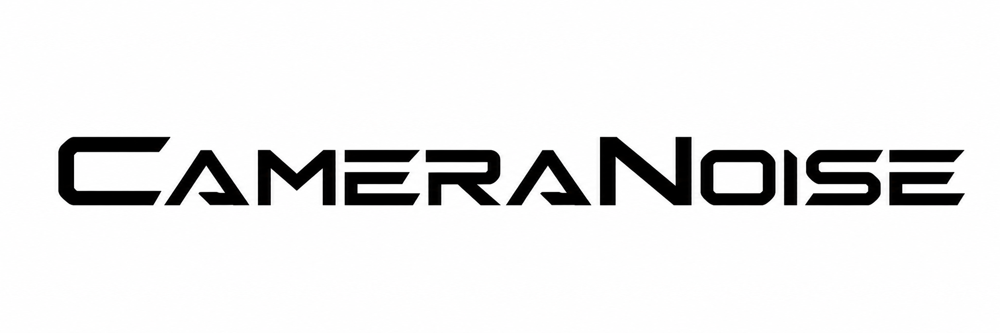
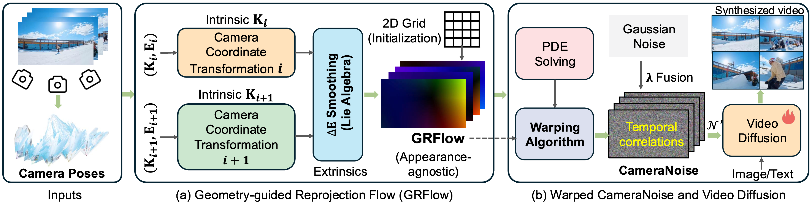
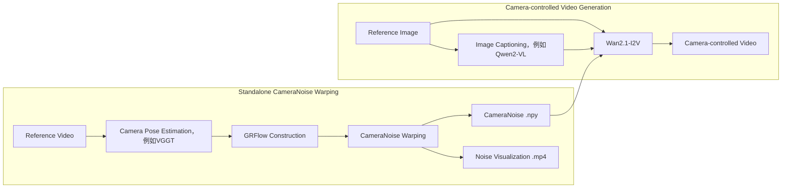

<p align="center">
  
</p>

<h2 align="center">[ICML 2026] CameraNoise: Enabling Faithful Camera Control in Video Diffusion through Geometry-Flow-Guided Noise Warping</h2>

<p align="center">
  <b>Haoyu Zhao, Jiaxi Gu, Haoran Chen, Qingping Zheng, Yeying Jin, Hongyi Yang, Junqi Cheng, Yuang Zhang, Zenghui Lu, Huan Yu, Jie Jiang, Peng Shu, Zuxuan Wu, Yu-Gang Jiang</b>
</p>

<p align="center">
  <a href="https://arxiv.org/abs/2605.30774">
    
  </a>
  <a href="https://gulucaptain.github.io/CameraNoise/">
    
  </a>
  <a href="https://huggingface.co/gulucaptain/CameraNoise-I2V">
    
  </a>
  
  
</p>

中文 | [English](README.md)

---

## 📌 News

* **2026-06-01**: We release the Image-to-Video inference pipeline and CameraNoise weights.
* **2026-05-29**: The CameraNoise paper is available on arXiv.
* **2026-05-01**: CameraNoise is accepted to **ICML 2026**.


---

## 🔥 项目介绍

**CameraNoise**是一种面向视频扩散模型的**相机运动控制框架**，旨在解决视频生成中相机轨迹可控性与几何一致性难以兼顾的问题。不同于直接将数值化相机参数注入模型主干的方式，CameraNoise 将相机姿态转换为扩散噪声空间中的时序一致随机表示，使相机运动与场景外观解耦，从而更稳定地迁移 reference video 中的镜头轨迹。

<p align="center">
  
</p>

我们的项目包含CameraNoise合成和Camera-controllable video generation两块内容：

1. **CameraNoise warping**：只关注“相机运动 → GRFlow → CameraNoise”的条件生成过程，不需要加载 QwenVL、Wan2.1 或 LoRA 权重，适合单独分析相机轨迹、调试噪声变形、复用 CameraNoise 条件或集成到其他视频扩散框架中。
2. **CameraNoise I2V 推理**：输入 reference image 和 reference video，自动完成相机估计、CameraNoise 构建、图像 caption 生成和最终视频生成。

核心上，CameraNoise warping 先通过 **Geometry-guided Reprojection Flow（GRFlow）** 从相机内外参中构建外观无关的几何运动场，再将该运动场作用于高斯噪声，生成与相机轨迹一致、同时尽量保持扩散噪声先验的 CameraNoise。借助这一噪声空间建模范式，CameraNoise 可以作为一种轻量、可复用的相机运动条件，引导 Wan2.1-I2V、Wan2.1-T2V 或其他视频扩散模型生成具有稳定结构、高视觉质量和准确相机运动的视频内容。

---

## ✨ 核心特性

* **Reference-video camera control**: 从任意 reference video 中估计相机运动，并迁移到新的 reference image 上。

* **Standalone CameraNoise warping**: 支持单独运行“相机位姿估计 → GRFlow 构建 → CameraNoise 合成”，无需启动完整视频生成流程。

* **Geometry-guided Reprojection Flow**: 基于相机内外参构建外观无关的几何运动表示，避免直接依赖图像纹理或语义内容。

* **Noise-space conditioning**: 将相机运动编码到 CameraNoise 中，作为视频扩散模型的时序噪声条件。

* **End-to-end I2V pipeline**: 一条命令完成相机估计、CameraNoise 合成、图像 caption 生成和最终视频推理。

* **Manifest logging**: 自动记录输入、条件、输出和关键参数，方便复现实验。

---

## 🧩 Pipeline

CameraNoise 的整体流程由两个相对独立的部分组成：前半部分是 **CameraNoise warping**，负责把 reference video 中的相机运动转换成噪声条件；后半部分是 **video generation**，负责将 reference image、caption 和 CameraNoise 输入到视频扩散模型中生成最终视频。



如果只关心相机运动条件本身，可以只运行的 **CameraNoise Warping**；如果需要完整生成视频，则运行完整 I2V pipeline。

---

## 🌀 单独使用 CameraNoise Warping

除了端到端 I2V 推理，本仓库也支持**单独生成 CameraNoise 条件**。这部分对应的是论文方法中的核心过程：将 reference video 中估计到的相机运动转换为扩散模型可使用的噪声空间条件。

独立的 CameraNoise warping 适合以下场景：

* 只想从 reference video 中提取并保存 CameraNoise，不立即进行视频生成；
* 需要检查相机轨迹估计、GRFlow 或噪声变形是否连续稳定；
* 希望将 CameraNoise 条件接入自己的视频扩散模型或其他推理框架；
* 需要批量预处理 reference videos，提前缓存 `.npy` 条件以加速后续实验；
* 希望单独可视化相机运动对应的 noise warping 过程。

该模块的基本输入和输出如下：

```text
Input:
  reference video
  camera pose estimation model，例如 VGGT
  CameraNoise warping config

Intermediate:
  camera poses
  GRFlow

Output:
  CameraNoise .npy                 # [T,H,W,C]
  CameraNoise visualization .mp4   # 用于检查噪声传播是否连续
```

更详细的运行方式、配置说明和可视化结果请参考：

[CameraNoise Warping指导](cameranoise_warping/README.md) (路径: cameranoise_warping/README_zh.md)


如果只需要复现或调试 CameraNoise warping，建议优先阅读上述独立文档。

---

## 📁 项目结构

```text
CameraNoise/
  cameranoise_i2v.py              # 端到端 I2V 推理入口
  inference.sh                    # 示例命令
  requirements.txt

  scripts/
    build_cameranoise.py          # CameraNoise 构建接口，可用于单独生成 CameraNoise
    caption_image_qwenvl.py       # QwenVL caption 生成接口
    generate_camera_control_video.py

  cameranoise_warping/            # 独立的 CameraNoise warping 模块
    configs/
      default.yaml                # CameraNoise warping 默认配置
    README_zh.md                  # 单独介绍 CameraNoise warping 的使用流程

  diffsynth/                      # Wan/DiffSynth 推理代码

  assets/
    cameranoise_icon.png
    teaser.png

  outputs/
    demo1/
      inputs/                     # reference image / reference video
      conditions/
        noises/                   # CameraNoise .npy 与可视化结果
        grflows/                  # GRFlow 中间结果
        camerapose/               # 相机位姿估计结果
      samples/                    # 最终生成视频
      manifest.json
```

其中，`cameranoise_warping/` 是本项目的核心条件构建模块。如果你只想生成 CameraNoise 条件，可以直接阅读：

```text
cameranoise_warping/README_zh.md
```

---

## ⚙️ 环境安装

推荐使用 [uv](https://docs.astral.sh/uv/) 管理 Python 环境。`uv` 安装速度快，并且可以统一管理 Python 版本、虚拟环境和依赖。

### 1. 安装 uv

macOS / Linux:

```bash
curl -LsSf https://astral.sh/uv/install.sh | sh
```

如果没有 `curl`，可以使用：

```bash
wget -qO- https://astral.sh/uv/install.sh | sh
```

Windows PowerShell:

```powershell
powershell -ExecutionPolicy ByPass -c "irm https://astral.sh/uv/install.ps1 | iex"
```

安装完成后，重新打开终端并检查：

```bash
uv --version
```

---

### 2. 创建 Python 环境

建议使用 Python 3.10：

```bash
cd CameraNoise
uv venv --python 3.10.14
```

激活环境：

```bash
source .venv/bin/activate
```

Windows:

```powershell
.venv\Scripts\activate
```

---

### 3. 安装 PyTorch

请根据你的 CUDA 版本选择对应的 PyTorch 安装命令。下面给出一个 CUDA 12.4 示例：

```bash
uv pip install torch torchvision torchaudio --index-url https://download.pytorch.org/whl/cu124
```

如果你的环境是 CUDA 12.1，可以使用：

```bash
uv pip install torch torchvision torchaudio --index-url https://download.pytorch.org/whl/cu121
```

---

### 4. 安装项目依赖

```bash
uv pip install -r requirements.txt
```

---

## 📦 下载预训练权重

CameraNoise 推理需要以下权重：

| 模型               | 用途                           | Hugging Face                                                                      |
| ---------------- | ---------------------------- | --------------------------------------------------------------------------------- |
| VGGT             | 从 reference video 估计相机运动     | [facebook/VGGT-1B](https://huggingface.co/facebook/VGGT-1B)                       |
| Qwen2-VL         | 为 reference image 生成 caption | [Qwen/Qwen2-VL-7B-Instruct](https://huggingface.co/Qwen/Qwen2-VL-7B-Instruct)     |
| Wan2.1-I2V       | 图像到视频生成基础模型                  | [Wan-AI/Wan2.1-I2V-14B-720P](https://huggingface.co/Wan-AI/Wan2.1-I2V-14B-720P)   |
| 我们训练的CameraNoise LoRA | CameraNoise 条件控制权重           | [gulucaptain/CameraNoise-I2V](https://huggingface.co/gulucaptain/CameraNoise-I2V) |

---

### 1. 安装 Hugging Face CLI

```bash
uv pip install -U "huggingface_hub[cli]"
```

如果模型需要登录或你想使用自己的 Hugging Face token：

```bash
huggingface-cli login
```

---

### 2. 下载基础模型权重

建议统一放到 `checkpoints/` 目录下：

```bash
mkdir -p checkpoints
```

下载 VGGT:

```bash
huggingface-cli download facebook/VGGT-1B \
  --local-dir checkpoints/VGGT-1B
```

下载 Qwen2-VL:

```bash
huggingface-cli download Qwen/Qwen2-VL-7B-Instruct \
  --local-dir checkpoints/Qwen2-VL-7B-Instruct
```

下载 Wan2.1-I2V:

```bash
huggingface-cli download Wan-AI/Wan2.1-I2V-14B-720P \
  --local-dir checkpoints/Wan2.1-I2V-14B-720P
```

---

### 3. 下载 CameraNoise 权重

```bash
huggingface-cli download gulucaptain/CameraNoise-I2V \
  --local-dir checkpoints/CameraNoise-I2V
```

下载后，你可以查看具体的 LoRA 文件名：

```bash
find checkpoints/CameraNoise-I2V -name "*.safetensors"
```

在推理时，将 `--lora-path` 指向对应的 `.safetensors` 文件即可，例如：

```bash
--lora-path checkpoints/CameraNoise-I2V/cameranoise_lora.safetensors
```

---

## 🚀 准备一个 Demo

每个 demo 对应 `outputs/` 下的一个文件夹。将 reference image 和 reference video 放到 `inputs/` 中：

```text
outputs/demo1/
  inputs/
    example.jpg       # reference image
    example.mp4       # reference video，用于提供相机运动
```

脚本会自动生成以下内容：

```text
outputs/demo1/
  conditions/
    caption.txt
    noises/
      example_noises.npy
      example_visualization.mp4
    camerapose/
    grflows/
  samples/
    demo1.mp4
  manifest.json
```

如果你已经有 CameraNoise `.npy`，也可以放在：

```text
outputs/demo1/conditions/noises/
```

我们在Huggingface中展示了仓库中outputs里demo的推理结果，位于：

```text
Huggingface: gulucaptain/CameraNoise-I2V/i2v_demo_results
```

---

## 🎬 端到端推理

下面是 576x1024 输出视频的示例：

```bash
python cameranoise_i2v.py \
  --demo-dir outputs/demo1 \
  --vggt-ckpt checkpoints/VGGT-1B \
  --cameranoise-config cameranoise_warping/configs/default.yaml \
  --qwenvl-model-path checkpoints/Qwen2-VL-7B-Instruct \
  --model-root checkpoints/Wan2.1-I2V-14B-720P \
  --lora-path checkpoints/CameraNoise-I2V/1024x576/cameranoise_i2v_wan2.1_1024x576_lora.safetensors \
  --height 576 \
  --width 1024 \
  --frames 49 \
  --sample-mode front \
  --degradation-value 0.2 \
  --cfg 3.5 \
  --device cuda \
  --output-type single
```

对outputs中的demo进行批量推理：

```bash
for i in {1..10}; do
    DEMO_DIR="outputs/demo${i}"

    if [ ! -d "$DEMO_DIR" ]; then
        echo "Skip ${DEMO_DIR}: directory not found."
        continue
    fi

    echo "========================================"
    echo "Running ${DEMO_DIR}"
    echo "========================================"

    python cameranoise_i2v.py \
        --demo-dir "$DEMO_DIR" \
        --vggt-ckpt checkpoints/VGGT-1B \
        --cameranoise-config cameranoise_warping/configs/default.yaml \
        --qwenvl-model-path checkpoints/Qwen2-VL-7B-Instruct \
        --model-root checkpoints/Wan2.1-I2V-14B-720P \
        --lora-path checkpoints/CameraNoise-I2V/1024x576/cameranoise_i2v_wan2.1_1024x576_lora.safetensors \
        --height 576 \
        --width 1024 \
        --frames 49 \
        --sample-mode front \
        --degradation-value 0.2 \
        --cfg 3.5 \
        --device cuda \
        --output-type single
done
```

---

## 🔁 推荐运行流程

CameraNoise 的端到端流程会自动执行以下步骤：

```text
reference video
    -> camera pose estimation
    -> GRFlow construction
    -> CameraNoise warping
    -> CameraNoise .npy / visualization

reference image
    -> QwenVL caption generation

reference image + caption + CameraNoise
    -> Wan2.1-I2V generation
    -> final video
```

如果需要调试，推荐将完整流程拆成三个阶段：

1. **Caption stage**: 先为 reference image 生成 `caption.txt`；
2. **CameraNoise warping stage**: 单独从 reference video 生成 CameraNoise `.npy` 和可视化视频；
3. **Video generation stage**: 复用已有 caption 和 CameraNoise，执行 Wan2.1-I2V 视频生成。

这种拆分方式可以避免重复加载 VGGT、QwenVL 和 Wan2.1-I2V，也便于批量缓存 CameraNoise 条件。尤其在需要测试不同 prompts、不同 LoRA 或不同生成参数时，可以固定同一个 CameraNoise 条件，从而更清楚地比较视频扩散模型对相机运动的响应。

---

## 📐 CameraNoise 尺寸

`cameranoise_i2v.py` 会根据最终输出视频尺寸自动推断 CameraNoise 的空间尺寸：

```python
cameranoise_downscale_size = [height // 8, width // 8]
```

例如：

```text
576x1024 -> [72, 128]
768x768  -> [96, 96]
```

幅值缩放参考尺寸默认是：

```bash
--cameranoise-std-reference-size 96
```

如果需要手动指定 CameraNoise 保存尺寸，可以传：

```bash
--cameranoise-downscale-size 72,128
```

---

## 🧪 重要参数

| 参数                                 | 说明                                                         |
| ---------------------------------- | ---------------------------------------------------------- |
| `--demo-dir`                       | demo 文件夹，里面需要包含 `inputs/`。                                 |
| `--vggt-ckpt`                      | VGGT 权重路径。需要从 reference video 生成 CameraNoise 时必填。          |
| `--cameranoise-config`             | 可选 YAML，会叠加到 `cameranoise_warping/configs/default.yaml` 上。 |
| `--cameranoise-std-reference-size` | CameraNoise 幅值/std 缩放参考尺寸，默认 `96`。                         |
| `--cameranoise-downscale-size`     | 保存的 CameraNoise 尺寸，格式为 `H,W`，默认 `[height/8, width/8]`。     |
| `--cameranoise-overwrite`          | 即使已有 CameraNoise，也重新生成。                                    |
| `--qwenvl-model-path`              | QwenVL 权重路径。缺少 `caption.txt` 时必填。                          |
| `--overwrite-caption`              | 即使已有 `caption.txt`，也重新生成 caption。                          |
| `--model-root`                     | Wan2.1-I2V-14B-720P 模型目录。                                  |
| `--lora-path`                      | CameraNoise LoRA 权重路径。                                     |
| `--height`, `--width`              | 最终生成视频的分辨率。                                                |
| `--frames`                         | 生成视频帧数。                                                    |
| `--cfg`                            | classifier-free guidance scale。                            |
| `--degradation-value`              | CameraNoise degradation value。不传时随机取 `[0, 0.6]`。           |
| `--sample-mode`                    | CameraNoise 帧采样方式：`front` 或 `even`。                        |
| `--output-type`                    | 输出模式：`single`、`concat` 或 `ct1`。                            |
| `--device`                         | 推理设备，例如 `cuda`。                                            |

---

## 📤 输出文件

成功运行后会得到：

```text
conditions/caption.txt                 # QwenVL 图像描述
conditions/noises/*_noises.npy         # CameraNoise, [T,H,W,C]
conditions/noises/*_visualization.mp4  # CameraNoise 可视化
samples/*.mp4                          # 最终生成视频
manifest.json                          # 输入、条件、输出和参数记录
```

其中，`manifest.json` 会记录输入文件、生成的条件文件、最终视频路径和关键运行参数，方便复现实验。

---

## ♻️ 复用已有条件

如果 `conditions/caption.txt` 已存在，脚本会直接复用。需要重新生成时传：

```bash
--overwrite-caption
```

如果 `conditions/noises/` 或 `inputs/` 中已经有 CameraNoise `.npy`，脚本会直接复用。需要重新生成时传：

```bash
--cameranoise-overwrite
```

这样可以把 VGGT、QwenVL 和最终视频生成拆开调试，避免重复计算。

---

## ✅ 注意事项

* 自动推断 CameraNoise 尺寸时，`--height` 和 `--width` 需要能被 `8` 整除。
* CameraNoise `.npy` 文件使用 `[T,H,W,C]` 格式。
* 576x1024 推理时，推荐 CameraNoise 尺寸为 `[72,128]`。
* 768x768 推理时，推荐 CameraNoise 尺寸为 `[96,96]`。
* 如果显存不足，可以尝试降低分辨率、帧数，或使用更少的采样步数。
* 如果只想调试相机条件，建议先生成并检查 `*_visualization.mp4`。
* 不同基础模型、LoRA 权重和 CameraNoise 尺寸需要保持兼容，否则可能导致生成质量下降。

---

## 🛠️ 常见问题

### 1. 已经有 caption，如何避免重复调用 QwenVL？

确保以下文件存在：

```text
outputs/demo1/conditions/caption.txt
```

然后正常运行主脚本即可。脚本会自动复用已有 caption。

---

### 2. 我只想生成 CameraNoise，不想运行视频生成，应该看哪里？

请阅读独立文档：

```text
cameranoise_warping/README_zh.md
```

该文档会更集中地介绍 CameraNoise warping 的输入、输出、配置和运行流程。主README中的端到端命令主要面向完整 I2V 推理。

---

### 3. 已经有 CameraNoise，如何直接复用？

将 `.npy` 文件放到以下任意位置：

```text
outputs/demo1/conditions/noises/
```

不要传 `--cameranoise-overwrite`，脚本会自动复用已有 CameraNoise。

---

### 4. 为什么需要 reference video？

reference video 用于提供目标相机运动。CameraNoise 会从该视频中估计相机位姿，并将相机运动转换为时序一致的噪声条件。

---

### 5. reference image 和 reference video 必须来自同一个场景吗？

不需要。reference image 提供生成内容和外观，reference video 提供相机运动。CameraNoise 的目标正是将 reference video 中的相机轨迹迁移到新的 reference image 上。

---

### 6. 推理结果不稳定怎么办？

可以尝试：

* 检查 reference video 是否存在强烈剪辑、快速转场或严重抖动；
* 检查 CameraNoise visualization 是否连续；
* 调整 `--degradation-value`；
* 调整随机种子；
* 降低相机运动幅度或使用更平滑的 reference video；
* 确认 CameraNoise 尺寸与输出分辨率匹配。

---

## 🗺️ TODO List

* [x] Release CameraNoise I2V inference code.
* [x] Release CameraNoise LoRA weights.
* [x] Support automatic CameraNoise construction from reference video.
* [x] Support manifest logging for reproducible inference.
* [ ] Release CameraNoise T2V inference code.
* [ ] Release CameraNoise Training code.
* [ ] Add more camera-motion visualization tools.
* [ ] Release additional checkpoints and ablation configs.
* [ ] Release training data.

---

## 📚 Citation

如果你觉得 CameraNoise 对你的研究有帮助，请引用我们的论文：

```bibtex
@inproceedings{zhao2026cameranoise,
  title     = {CameraNoise: Enabling Faithful Camera Control in Video Diffusion through Geometry-Flow-Guided Noise Warping},
  author    = {Zhao, Haoyu and Gu, Jiaxi and Chen, Haoran and Zheng, Qingping and Jin, Yeying and Yang, Hongyi and Cheng, Junqi and Zhang, Yuang and Lu, Zenghui and Yu, Huan and Jiang, Jie and Shu, Peng and Wu, Zuxuan and Jiang, Yu-Gang},
  booktitle = {Proceedings of the Forty-third International Conference on Machine Learning},
  year      = {2026}
}
```

---

## 🙏 Acknowledgements

本项目基于或参考了以下优秀开源项目与模型：

* [VGGT](https://huggingface.co/facebook/VGGT-1B)
* [Qwen2-VL](https://huggingface.co/Qwen/Qwen2-VL-7B-Instruct)
* [Wan2.1](https://huggingface.co/Wan-AI/Wan2.1-I2V-14B-720P)
* [Hugging Face](https://huggingface.co/)
* [DiffSynth](https://github.com/modelscope/DiffSynth-Studio)

感谢这些工作对开源社区的贡献。

---

## 📄 License

本仓库代码与 CameraNoise 权重默认遵循 Apache-2.0 License。
请注意，第三方基础模型可能具有各自的许可证要求，例如 VGGT、Qwen2-VL 和 Wan2.1。使用前请阅读并遵守对应模型仓库的 license 和使用条款。
